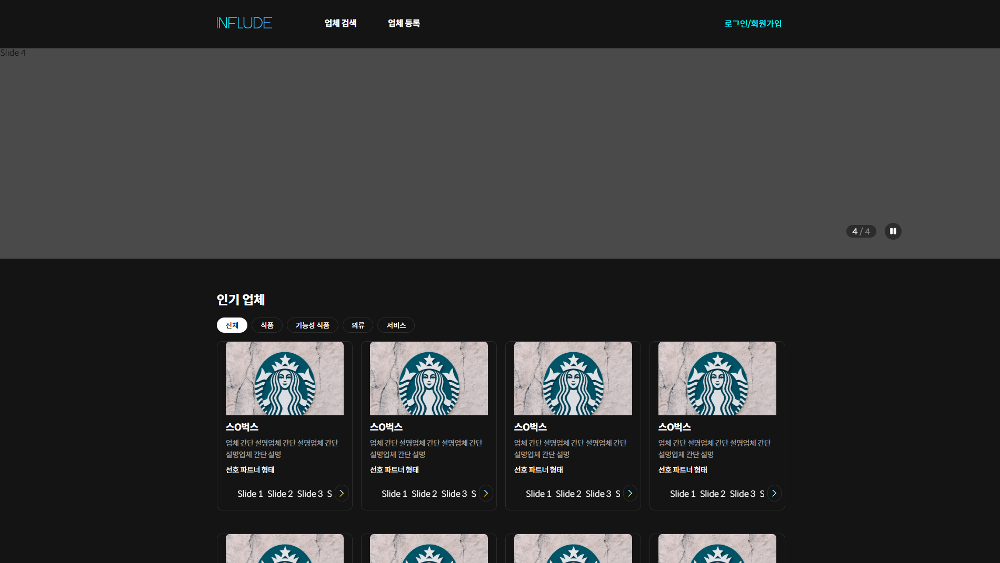
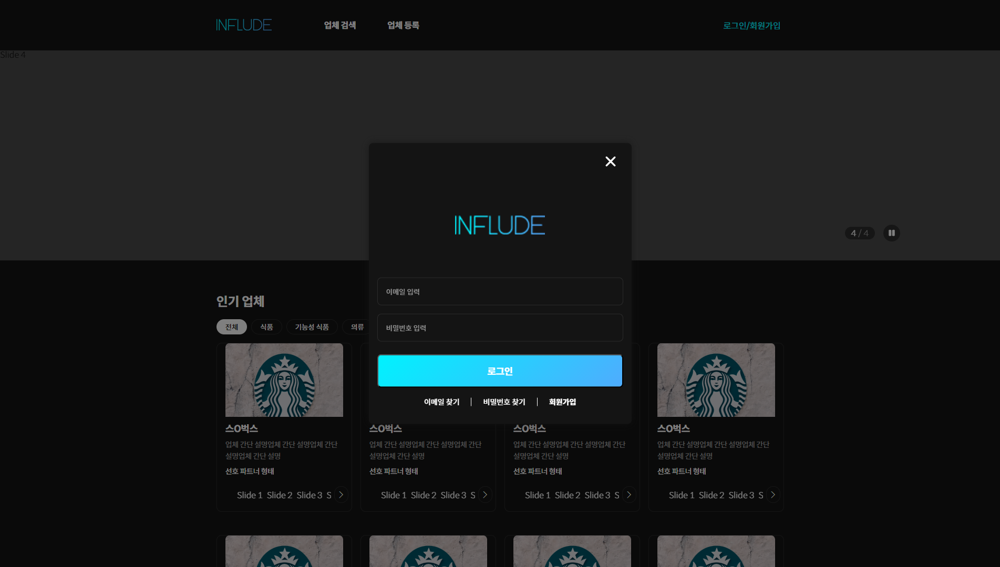
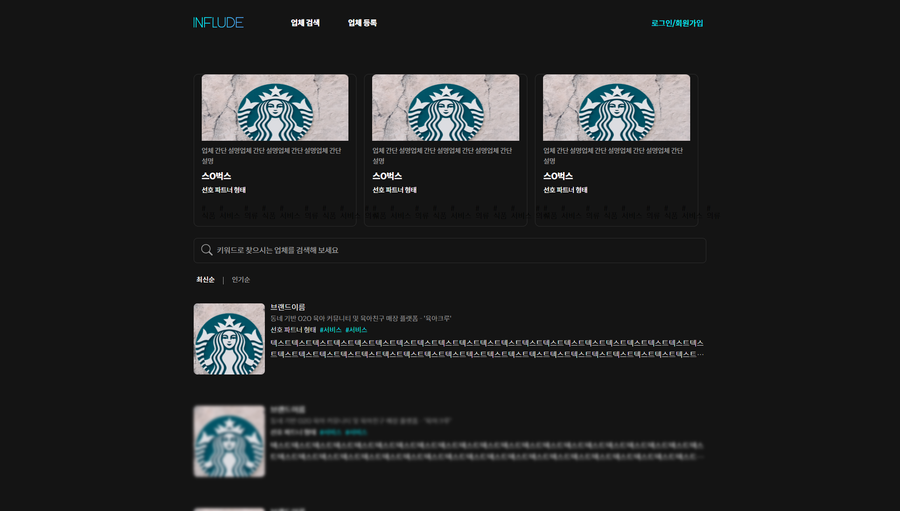
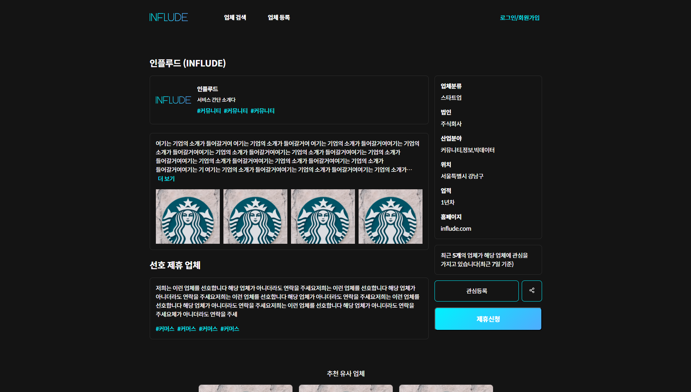

# influde

## 서비스 소개

- 파트너-업체-찾기-사이트
.
## Skill Set


## 실행

```
npm build
npm run start
```

## Front-end Developer

- 배정태

## Planner

- 배광태

# 진행상황

현재 반응형 작업 전 기획자 요구사항에 맞게 작업 진행중

# 페이지 이미지

메인페이지

로그인 페이지

업체 목록 페이지

업체 등록 페이지

